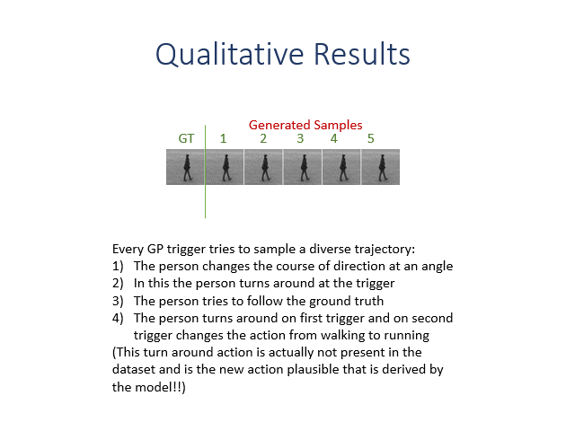

# Diverse Video Generation
This is code for the paper [Diverse Video Generation using a Gaussian Process Trigger](https://openreview.net/forum?id=Qm7R_SdqTpT) by [Gaurav Shrivastava](https://www.cs.umd.edu/~gauravsh/) and [Abhinav Shrivastava](https://www.cs.umd.edu/~abhinav/). 


## KTH action dataset
First download the KTH action recognition dataset by running:
```
sh data/download_kth.sh /my/kth/data/path/
```
where /my/kth/data/path/ is the directory the data will be downloaded into. Next, convert the downloaded .avi files into .png's for the data loader. To do this you'll want [ffmpeg](https://ffmpeg.org/) installed. The following script will do the conversion:
```
python data/convert_lua_pytorch.py
```
Experimental results in the paper used 64x64.
To train the DVG model on 64x64 KTH videos run:
```
python train.py --data_root //path/to/the/data --image_width 64 --dataset kth --channels 1
```

To generate frames using a pretrained DVG model on 64x64 KTH videos run:
```
python generate_frames.py --data_root //path/to/the/data --image_width 64 --dataset kth --channels 1
```
<p align="center">

</p>
